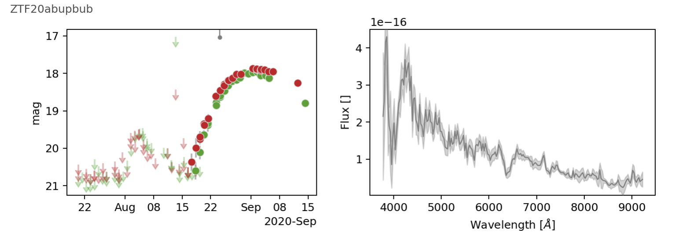
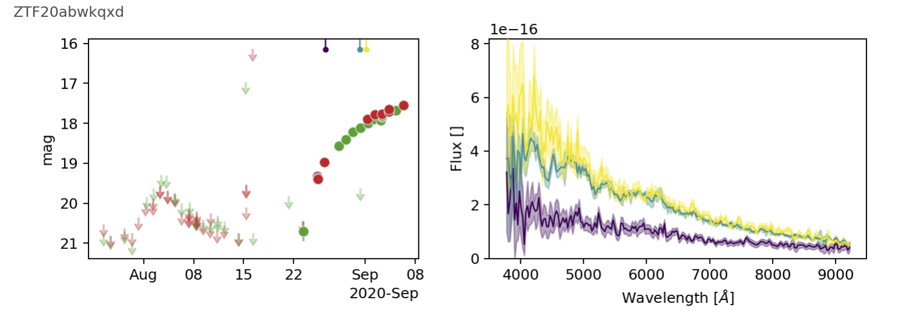

# ztftarget
ZTF target base tools

# Description
This modules enables you to use ZTF data at the target level. It is based on the (`ztfquery`)[https://github.com/MickaelRigault/ztfquery] module. 

# Installation
```bash
git clone https://github.com/MickaelRigault/ztftarget.git
cd ztftarget
python setup.py install
```

# Usage
This assumes that you already have a setup and running `ztfquery` installation and that you have access to the marshal (`from ztfquery import marshal`). 

```python
from ztftarget import target
t = target.ZTFTarget.from_name('ZTF20abupbub')
t.show()
```
<p align="left">
  
</p>
if a target has several spectra, these are all shown. See the matching-color top-ticks.
<p align="left">
  
</p>


A `ZTFTarget` has basic information such as _redshift_ (`t.z` and `t.zerr`), _coordinates_ (`t.radec`) and classification (`t.classification`). When loading the instance with the `from_name()` classmethod these parameters are loaded from your local storage of the marshal sources (`ztfquery.marshal.MarchalAccess.load_local()`).  

In addition `ZTFTarget` has a lightcurve (`t.lightcurve`) and spectra (`t.spectra`). Lightcurve and spectra are downloaded automatically if you do not have them stored locally already.

All have `set`  methods (e.g., `t.set_coordinates(ra, dec)` or `t.set_lightcurve(dataframe)`).


# Component details
The target Lightcurve and spectra are registed as `t.lightcurve` and `t.spectra`, which are `ztftarget.ZTFLightCurve` and `ztftarget.ZTFSpectra` object respectively. 

- `ztftarget.ZTFLightCurve` is a wrapper around a single dataframe accessible as `ztftarget.ZTFLightCurve.data`
- `ztftarget.ZTFSpectra` is a derived from `pyifu.spectroscopy.Spectrum` and has methods likes `show()`, `sythesize_photometry()` etc.
